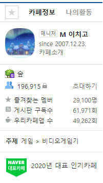
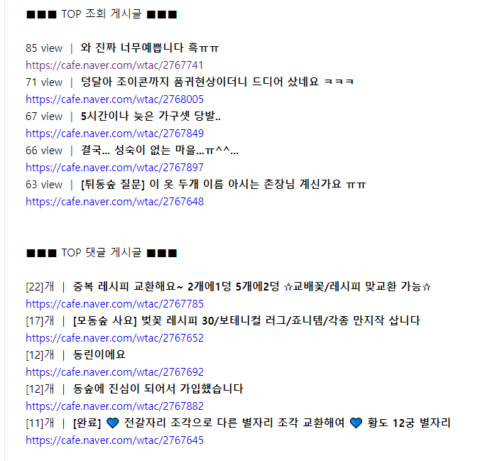

# 네이터 카페 인기글 크롤링 개발 노트

> 
> ### 홍보 팜플렛 
>  &nbsp;&nbsp;&nbsp;
>
 [Smile Bot 운영 페이지 바로가기](https://cafe.naver.com/wtac)

> ### 크롤링 결과 
>
> 

 

------

## 개발 환경
- [Node.js] 
- [Puppeteer] 

 

------

## 개발 기간
- 2020.05.12~05.18

 

------

## 주요 서비스
1. 자동으로 N 시간마다 등록된 글을 크롤링하여 인기 게시글의 랭킹 제공 
2. 인기 게시글의 종류로 조회수, 댓글 별 Top 5 게시글을 선별
3. 알고리즘을 통해 불필요한 게시글은 제외하여 글 보기 가능

